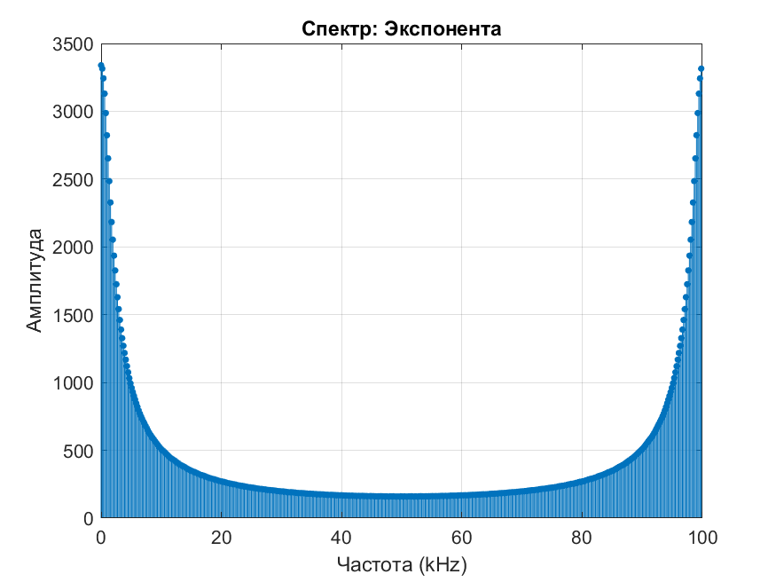

# ОТЧЁТ
по лабораторной работе  
"Анализ дискретных сигналов и линейных дискретных систем"

Выполнил:  
ФИО: ___________________  
Группа: ________________  
Дата: __________________

## 1. Исходные данные
- Интервал дискретизации: T = 10 мкс  
- Задержка: Nз = 51  
- Параметр экспоненты: a = 1.1  
- Импульсная характеристика:  ```h(n) = -1, n = -4:-1
0, n = 0
+1, n = 1:4```
  
## 2. Исходные сигналы
### 2.1 Импульсная характеристика
![ИХ h[n]](report_images/00_original_h.png)  
*Рис. 1. Антисимметричная импульсная характеристика*

### 2.2 Дискретная экспонента
  
*Рис. 2. Сигнал экспоненциального роста (1.1^n)*

### 2.3 Гармонические сигналы
  
*Рис. 3. Сигналы с частотами 20 кГц, 50 кГц и 60 кГц*

## 3. Результаты выполнения заданий
### 3.1 Пункт 1 - Формирование сигналов
#### а) Единичный импульс и скачок
  
*Рис. 4. Единичный импульс (δ[n]) и скачок (u[n])*

#### б) Задержанные сигналы
  
*Рис. 5. Сигналы с задержкой 51 отсчёт*

### 3.2 Пункт 2 - Гармонические сигналы
*(Используется Рис. 3 из раздела 2.3)*

### 3.3 Пункт 3 - Спектры сигналов
| Сигнал | Спектр |
|--------|--------|
| Единичный импульс |  |
| Единичный скачок |  |
| Экспонента |  |

*Таблица 1. Примеры спектров (остальные аналогично)*

### 3.4 Пункт 4 - Реакции ЛДС
#### Импульсная характеристика
*(Используется Рис. 1)*

#### Пример реакции на экспоненту
  
*Рис. 6. Реакция системы на экспоненциальный сигнал*

### 3.5 Пункт 5 - Спектры реакций
  
*Рис. 7. Спектр реакции на экспоненту*

### **Выводы по лабораторной работе**  

1. **Синтез дискретных сигналов**  
   - Успешно сформированы все требуемые сигналы: единичный импульс, скачок, задержанные версии, дискретная экспонента и гармонические колебания.  
   - Задержка на **Nз = 51** отсчёт корректно отразилась в сигналах, что подтверждает правильность алгоритма.  

2. **Анализ гармонических сигналов**  
   - При **f = 20 кГц (< f Найквиста)** сигнал отображается без искажений.  
   - При **f = 50 кГц (= f Найквиста)** наблюдается предельный случай дискретизации — два отсчёта на период.  
   - При **f = 60 кГц (> f Найквиста)** проявился **эффект наложения (алиасинг)**, и сигнал воспринимается как **40 кГц**.  

3. **Спектральный анализ**  
   - Спектр единичного импульса равномерный (все частоты равной амплитуды), что соответствует теории.  
   - Спектр единичного скачка содержит низкочастотную составляющую и гармоники.  
   - Экспоненциальный сигнал показал резкий спад амплитуды с ростом частоты.  

4. **Реакция ЛДС**  
   - Импульсная характеристика **h(n)** (антисимметричный фильтр) вызвала характерные изменения сигналов:  
     - Для единичного импульса реакция совпала с **h(n)**.  
     - Для гармоник система вела себя как **полосовой фильтр**, подавляя определённые частоты.  
   - На гармонике **60 кГц** реакция системы подтвердила наличие алиасинга.  

5. **Общий итог**  
   - Работа подтвердила основные принципы дискретной обработки сигналов:  
     - Важность соблюдения **теоремы Котельникова** (f ≤ fₙ/2).  
     - Влияние импульсной характеристики на сигнал (свёртка).  
     - Возможность анализа сигналов в частотной области через ДПФ.  
